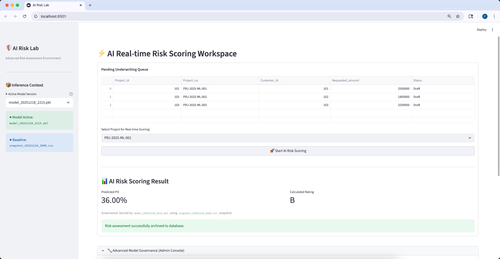
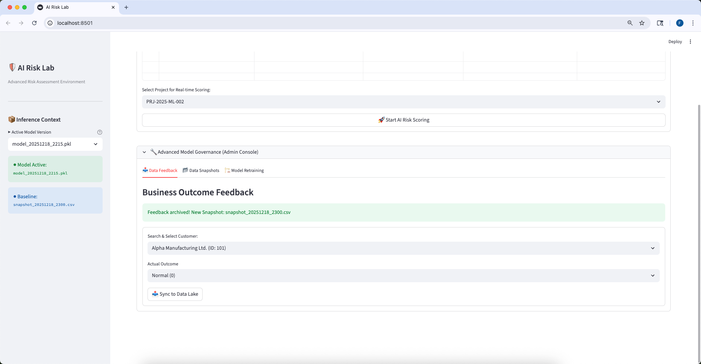
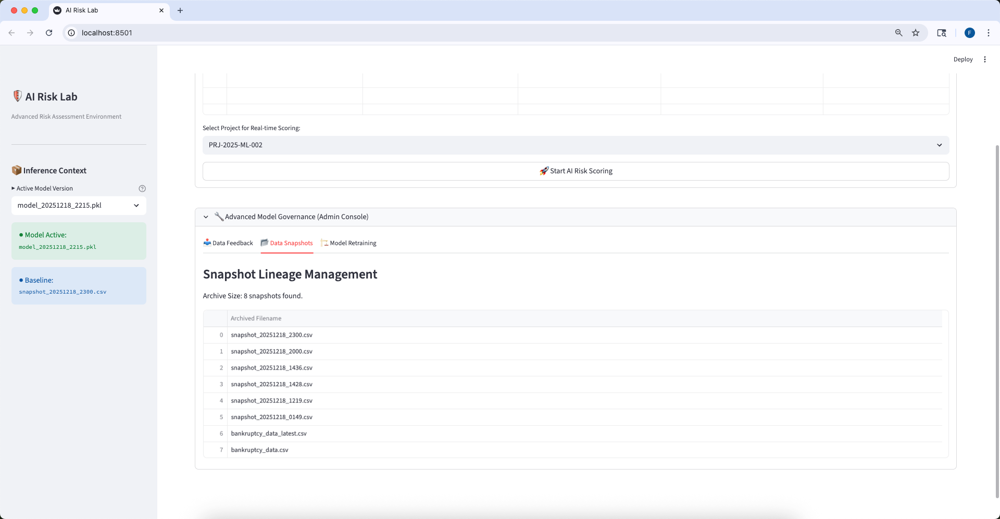
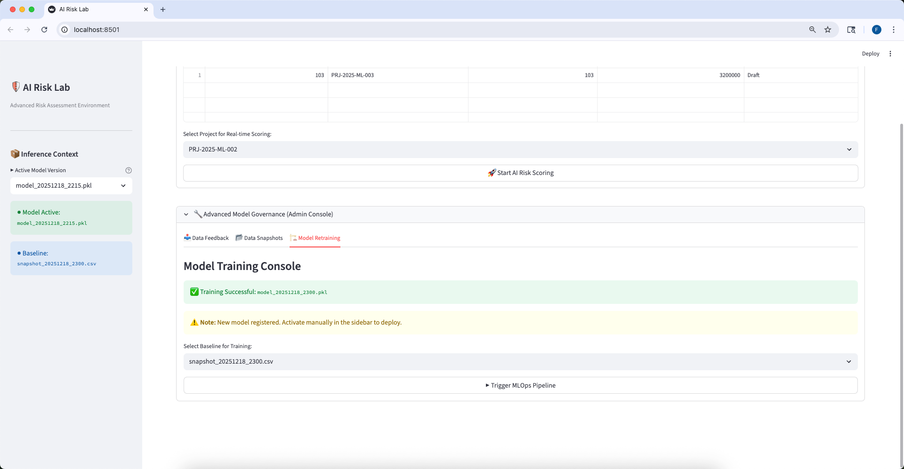

# AI Risk Lab: End-to-End AI-Driven Credit Risk Management System

## 📌 Project Overview
AI Risk Lab is a professional-grade, workflow-based database application designed for **SME Credit Risk Assessment**. It demonstrates a seamless integration between a transactional **OLTP/ODS database (Azure MySQL Flexible Server)** and a modern **MLOps ecosystem**.

The system operationalizes the **DIKW (Data-Information-Knowledge-Wisdom)** hierarchy by transforming raw financial data into actionable credit insights while maintaining strict human-in-the-loop governance.

## 🛠️ Tech Stack
- **Frontend**: Streamlit (Interactive Workflow Orchestration)
- **Database**: Azure Database for MySQL (Flexible Server)
- **Data Lake**: Azure Blob Storage (Snapshot versioning & Training data)
- **ORM**: SQLAlchemy (Domain entity state management)
- **ML Engine**: Scikit-learn (Random Forest, SMOTE, StandardScaler)
- **Connectivity**: mysql-connector-python

## ✨ Key Features
- **Stateless AI Inference**: Real-time Probability of Default (PD) scoring and credit rating mapping.
- **Ground Truth Injection**: A closed-loop feedback system that syncs verified business outcomes back to the Data Lake.
- **Governed Retraining**: Versioned dataset snapshots and automated retraining pipelines with SMOTE bias mitigation.
- **Hybrid Data Access**: Optimized direct SQL for inference performance and ORM for transactional integrity.
- **Schema-on-Read Strategy**: Efficient management of 95+ financial features via semi-structured JSON storage.

## 📂 Repository Structure
- `app.py`: Main Streamlit application and orchestration logic.
- `scoring_engine.py`: Stateless inference module for real-time scoring.
- `retrain_model.py`: MLOps pipeline for model training and versioning.
- `database/`: SQL scripts for Azure MySQL schema deployment.
- `models/`: Registered model artifacts (.pkl) and scalers.

## ⚖️ Governance & Ethics
This system implements "Human-in-the-Loop" governance, ensuring that AI insights serve as decision support rather than unchecked automated actions. It addresses algorithmic bias through SMOTE and maintains full auditability via immutable data snapshots.

## 🖥️ Application Overview
 docs/ui_overview.png
 
## 🔍 AI Risk Assessment Workflow

### AI-Based Credit Risk Scoring

### Ground Truth Injection & Feedback Loop

## 📊 Data Governance & MLOps

### Dataset Snapshot Versioning

### Model Retraining Pipeline Execution

